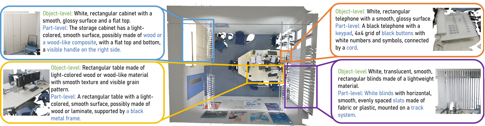

# ExCap3D: Expressive 3D Scene Understanding via Object Captioning with Varying Detail

[<ins>Paper</ins>](https://arxiv.org/pdf/2503.17044) | [<ins>Dataset</ins>](https://drive.google.com/drive/folders/1R0X5ZqY_jxh0vuPcEm3JNtkKwRIAgSxH?usp=sharing) | [<ins>Video</ins>](https://www.youtube.com/watch?app=desktop&v=SQRV1l_0oY0)



[<ins>Chandan Yeshwanth</ins>](https://cy94.github.io/), [<ins>Dávid Rozenberszki</ins>](http://rozdavid.github.io/), [<ins>Angela Dai</ins>](https://www.3dunderstanding.org/)

**ICCV 2025**

---
Contents
===
* [Dataset](#dataset)
* [Code](#code)
* [Citation](#citation)

---

## Dataset 
1. Apply for and download the ScanNet++ dataset from [here](https://kaldir.vc.in.tum.de/scannetpp/) 
1. Download the captions for the train and val sets of the ExCap3D dataset [here](https://drive.google.com/drive/folders/1R0X5ZqY_jxh0vuPcEm3JNtkKwRIAgSxH?usp=sharing)

## Code
Coming soon!

## Citation
If you find our code, dataset or paper useful, please consider citing
```
@inproceedings{yeshwanth2025excap3d,
  title={ExCap3D: Expressive 3D Scene Understanding via Object Captioning with Varying Detail},
  author={Yeshwanth, Chandan and Rozenberszki, David and Dai, Angela},
  booktitle={Proceedings of the IEEE/CVF International Conference on Computer Vision},
  year={2025}
}
```
